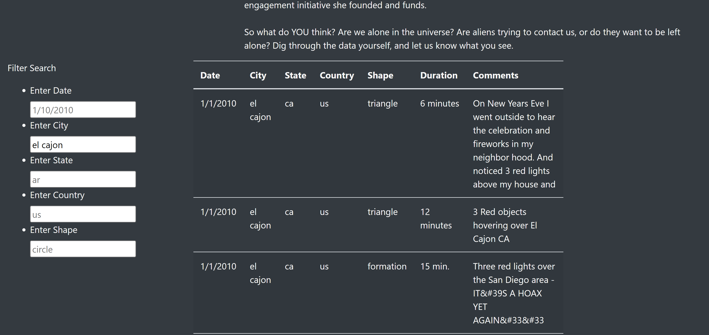

# UFO Webpage Design

## Overview:
A client, Dana, created a webpage and dynamic table of UFO sitings. She wants a more in-depth analysis of UFO sitings by allowing webpage users to filter for multiple criteria at the same time. In addition to the date, I helped her add table filters for the city, state, country, and shape.

## Results: 

Webpage users may enter in as many filters as they like, click outside of the filter search, and see which UFO sightings match the search. For example, below I filtered for the city "el cajon" and can see all the UFO sitings in that city.

Here, I've added a filter for UFO shape and can see all UFO sitings for both specified city and shape. There is no limit for how many filters can be applied to the table.

## Summary: 
The biggest drawback of this new design is the specified input style for each filter. For example, below I've filtered the table to show UFO sitings in California. The filter has to exactly match the text style in the table, in this case: "ca." 

Below you'll see if you type out "California" or even capitalize the abbreviation ("CA"), the filter won't work.

There are placeholder examples of the text style needed to successfully filter the table:

